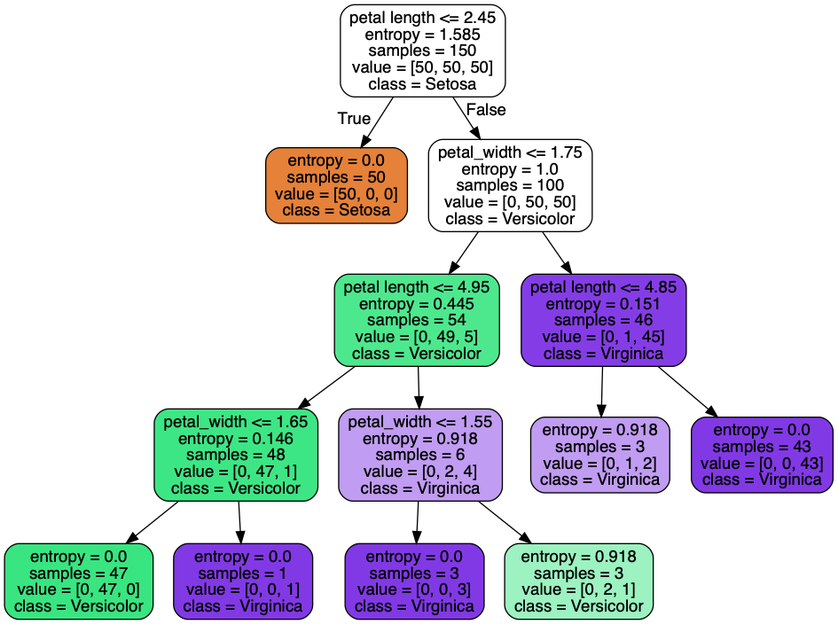
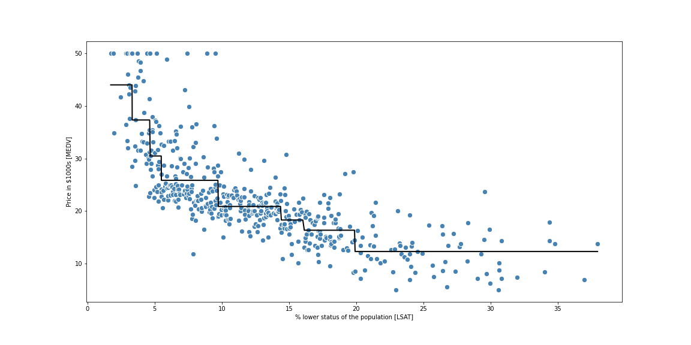

# Machine Learning with scikit-learn

```
pipenv install scikit-learn seaborn pandas jupyterlab numpy matplotlib pydotplus graphviz
```
Activate the virtual environment:
```
pipenv shell
```
And run:
```
jupyter lab
```
in this environment


### Classification Trees
Notebook following along this article: https://towardsdatascience.com/https-medium-com-lorrli-classification-and-regression-analysis-with-decision-trees-c43cdbc58054



### Regression Trees
Notebook following along this article: https://towardsdatascience.com/https-medium-com-lorrli-classification-and-regression-analysis-with-decision-trees-c43cdbc58054



### flowers.py
Python implementation of a decision tree classifier for Iris flower dataset.

Implmented by following Google's "Machine Learning Recipes with Josh Gordon" tutorials.
